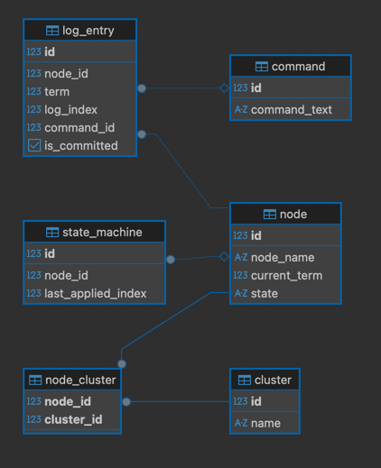

## Database Schema
### Running the Database

Start the PostgreSQL container:

```bash
docker-compose up -d
```

The database schema is automatically initialized using:

db/schema.sql

The script uses CREATE TABLE IF NOT EXISTS, so restarting the container will not cause failures if the tables already exist.

### Database credentials :

    Host: localhost
    Port: 5432
    Database: concentra
    User: admin
    Password: admin

### Entities relationship diagram



The schema includes all required relationship types:

#### One-to-One
- `node` ↔ `state_machine`
    - Each node has exactly one state machine

#### One-to-Many
- `node` → `log_entry`
    - One node can have multiple log entries

#### Many-to-Many
- `node` ↔ `cluster` (via `node_cluster`)
    - A node can belong to multiple clusters and vice versa
